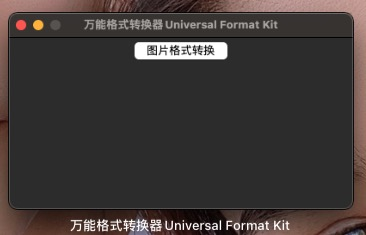
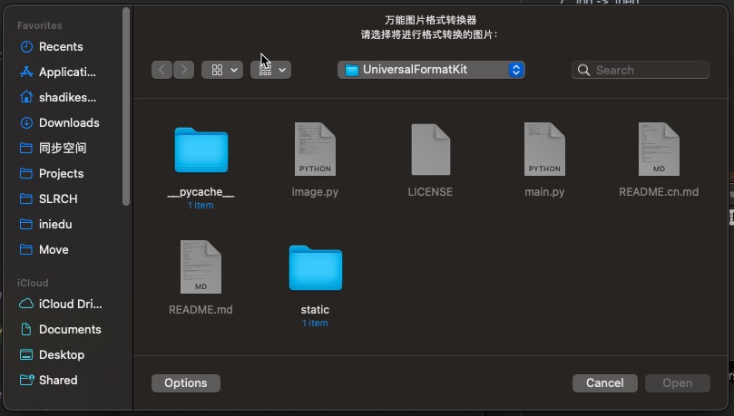
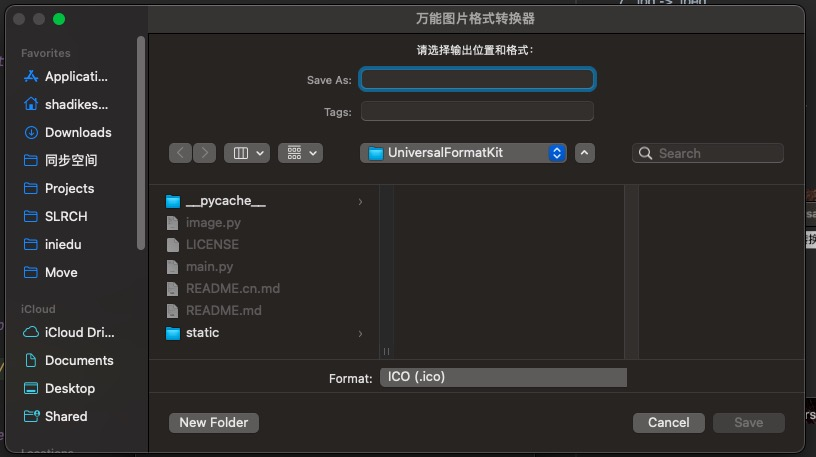

# 万能的多平台格式转换器

简体中文 |  [English](./README.md)

这是一个利用Pillow和Tk等优良的工具库实现的跨平台格式的转换工具。

## 支持的平台

1. Windows
2. Mac
3. Unix

## 支持的图片格式

1. .png -> .ico
2. .jpg -> .ico
3. .jpeg -> .ico
4. .png -> .jpg
5. .png -> .jpeg
6. .jpg -> .png
7. .jpg -> .jpeg
8. .jpeg -> .png
9. .jpeg -> .jpg

## 界面展示
### 程序主界面

### 图片格式转换工具
#### 选择源图片:

#### 选择输出路径以及输出格式:

## 更新日志：
#### v1.0.1 实现了可视化选择输入和输出文件路径及格式。
#### v1.0.2 为UniversalFormatter实现了一个可视化主页（root）。
#### v1.0.3 修复了图片格式转换工具中没有选择输入文件时，没有直接退出，而让选择输出路径及格式的Bug。
#### v1.0.4 修复了图片路径检验代码存在的Bug。
#### v1.0.5 新增了成功提示消息框功能。

## 开发计划
* [ ] 实现视频转GIF动图

## 感谢巨人

## 杰出贡献者

<a href="https://github.com/Haoke98" target="_blank">

 
萨达木·沙地克
</a>

## 联系我们

- 如果有有关项目的什么问题，可以随时联系我们。
- 电子邮箱📮：1903249375@qq.com

## 友情链接

- [Pillow官方文档](https://pillow.readthedocs.io/en/stable/#)
- [TkDocs](https://tkdocs.com/)