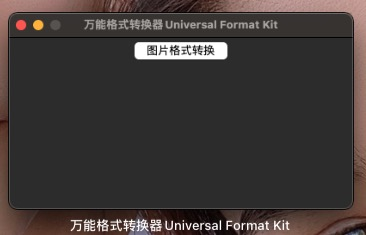
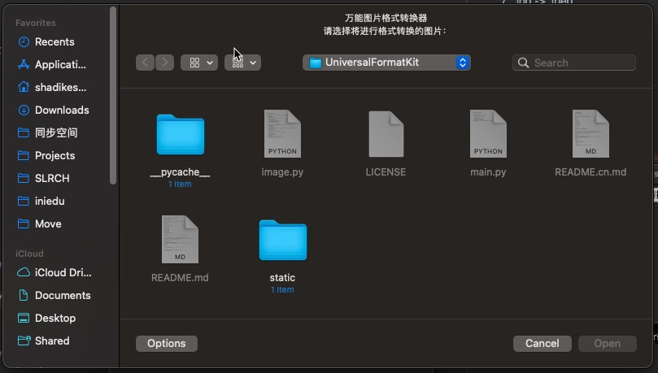
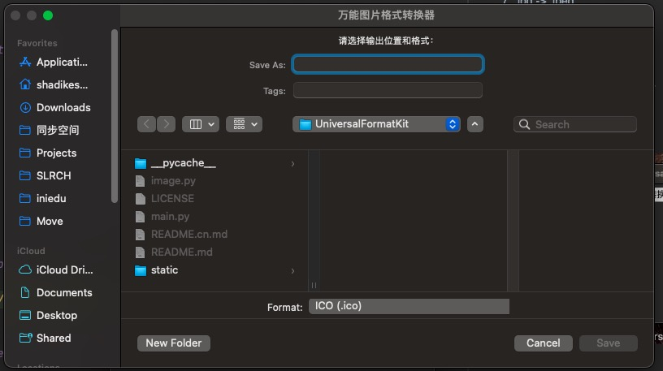

# Universal multi platform formatter.

[简体中文](./README.cn.md) |  English

This is a cross platform format conversion tool using excellent tool libraries such as pilot and TK.

## Supported platforms

1. Windows
2. Mac
3. Unix

## Supported picture formats

1. .png -> .ico
2. .jpg -> .ico
3. .jpeg -> .ico
4. .png -> .jpg
5. .png -> .jpeg
6. .jpg -> .png
7. .jpg -> .jpeg
8. .jpeg -> .png
9. .jpeg -> .jpg

## Interface Display
### Home （root）

### ImageFormatTool
#### Choose Source Image:

#### Choose Save Location and Target Extension:

## Update log：
#### v1.0.1 It realizes the visual selection of input and output file paths and formats.
#### v1.0.2 Implemented a visual Home (root) page for the UniversalFormatter.

## Thank the giant

## Outstanding contributor

<a href="https://github.com/Haoke98" target="_blank">

 
Sadam·Sadik
</a>

## Contact us

- If you have any questions about the project, please feel free to contact us.
- Email📮：1903249375@qq.com

## Links

- [Pillow Official Documents](https://pillow.readthedocs.io/en/stable/#)
- [TkDocs](https://tkdocs.com/)